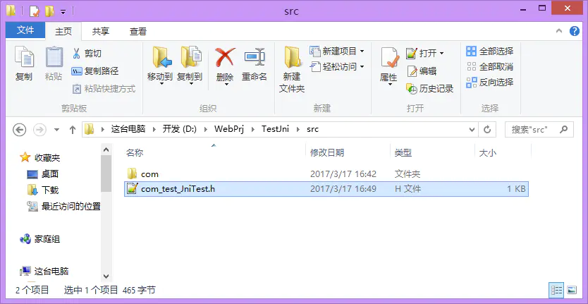
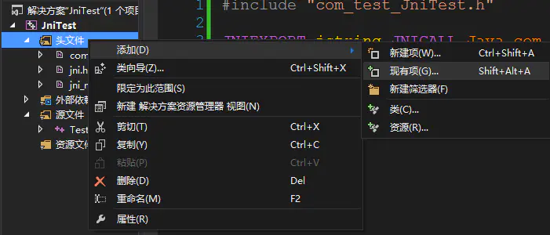
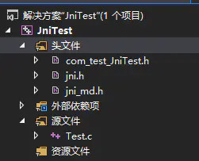
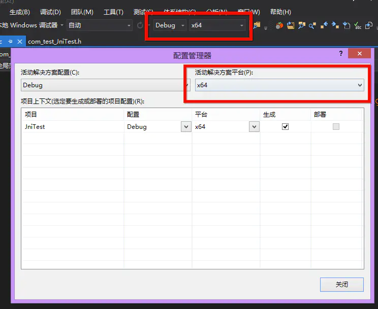
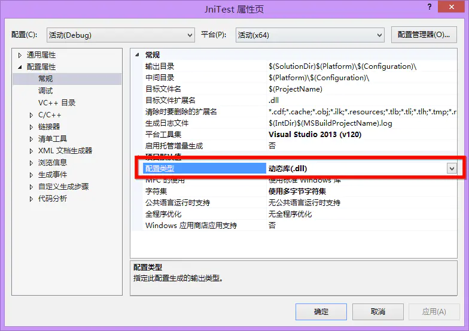
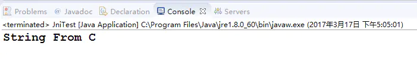
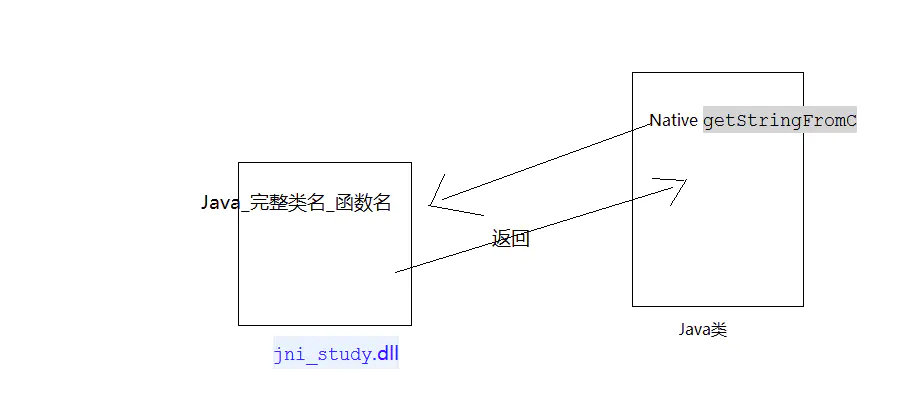

### NDK

NDK: Native Development Kit，NDK提供了一系列的工具，帮助开发者快速开发C（或C++）的动态库，并能自动将so和java应用一起打包成apk。

使用NDK的原因：

1. 安全。Java容易反编译，C/C++不容易。
2. 效率。Java实现效率低或者不能实现。

### JNI

JNI（Java Native Interface）：Java调用C/C++，C/C++调用Java的一套API。

NDK开发需要用到JNI。

#### JNI开发流程

1. 编写native方法。
2. javah命令，生成.h头文件。
3. 复制.h头文件到CPP工程中。
4. 复制jni.h和jni_md.h文件到CPP工程中。
5. 实现.h头文件中声明的函数。
6. 生成dll文件。
7. 配置dll文件所在目录到环境变量。
8. 重启Eclipse。

##### JNI开发流程详细步骤说明

创建Java工程，编写native方法，例如这里创建了getStringFromC方法，为了方便在main函数中使用，加上static：

```java
package com.test;

public class JniTest {

    public static native String getStringFromC();

}
```

打开命令行，通过cd命令转到当前Java工程的src目录下面，然后执行javah命令，参数是完整类名：


然后就会在src目录就会生成.h头文件：



然后将这个头文件拷贝到C/C++工程目录下，然后在VS中通过“添加现有项”，加到工程中：



同理，提示缺乏jni.h文件的时候，到JDK目录下把jni.h、jni_md.h也通过这种方法加进来，完整的项目如下：



###### 注意：include<>是引入系统的头文件，include""是引入自己的头文件，因此这里需要改一下，否则会报错。

最后，在Test.c文件中实现native方法：

```c
#include "com_test_JniTest.h"

JNIEXPORT jstring JNICALL Java_com_test_JniTest_getStringFromC
(JNIEnv * env, jclass jcls){

    //返回Java的字符串，这里先不作讲解
    return (*env)->NewStringUTF(env, "String From C");

}
```

配置解决方案平台，新建平台，选择ARM X64平台：



配置解决方案的类型，选择输出动态库文件：



###### Windows下面动态库以dll结尾，Linux下面以so结尾。

通过“生成解决方案”，就会在工程生成dll文件，然后把这个目录添加到环境变量中，这样组偶的目的是为了Java在执行的时候能够找到我们的动态库文件。

最后回到Java工程，通过System.loadLibrary导入动态库，然后在main方法中测试native方法：

```java
package com.test;

public class JniTest {

    static {
        System.loadLibrary("JniTest");
    }

    public static native String getStringFromC();

    public static void main(String[] args) {
        String str = getStringFromC();
        System.out.println(str);
    }

}
```

###### 因为修改了环境变量，因此需要重启Java IDE。否则会报找不到动态库文件的错误。



##### JNI的调用过程

如下图所示，在调用native方法的时候，先去动态库里面找对应的实现，命名的规则是：

	Java_完整类名_函数名

如果有返回的话，就返回给Java层。



#### 动态库与静态库

不同平台下的区别：

1. Linux平台下：动态库是.so，静态库是.a
2. Windows平台下：动态库是.dll，静态库是.lib

动态库与静态库的区别：

1. 如果使用静态库，全部都会包含在最终生成的exe文件。动态库是不会包含的，运行的时候才会被程序加载进来。
2. 动态库可以多个应用共享（动态加载即可使用），加载不加载/什么时候加载可以由程序自己完成。

#### JNI开发中JNIEnv在C和C++中实现的区别

##### JNIEnv：JNIEnv里面有很多方法，与Java进行交互，代表Java的运行环境。JNI Environment。

在C中，JNIEnv是结构体指针的别名，因此env是二级指针：

```c
JNIEXPORT jstring JNICALL Java_com_test_JniTest_getStringFromC(JNIEnv * env, jclass jcls){
    // env是一个二级指针，函数中需要再次传入env
    return (*env)->NewStringUTF(env, "String From C");
}
```

在C++中，JNIEnv是一个结构体的别名，因此env是一级指针：

```cpp
JNIEXPORT jstring JNICALL Java_com_test_JniTest_getStringFromC(JNIEnv * env, jclass jcls){
    // env是一个一级指针，函数中不需要再次传入env
    return env->NewStringUTF("String From CPP");
}
```

##### 为什么要用二级指针

1. 为什么需要传入JNIEnv？因为native函数执行过程中需要JNIEnv
2. C++为什么没有传入？因为C++中有this指针
3. C++只是对C的那一套进行的封装，给一个变量赋值为指针，这个变量是二级指针

#### 源码分析

在jni.h头文件中有下面的预编译代码：

```c
#ifdef __cplusplus
typedef JNIEnv_ JNIEnv;
#else
typedef const struct JNINativeInterface_ *JNIEnv;
#endif
```

1. 如果是C环境的话，JNIEnv就是一个JNINativeInterface_结构体的指针别名。
2. 如果是C++环境的话，JNIEnv就是一个结构体JNIEnv_的别名，而JNIEnv_是对JNINativeInterface_的封装。

注意：在结构体与指针的文章中有下面的说明：

```c
struct Person* p = &p2;

printf("%s,%d",(*p).name,(*p).age);
// 等价于
printf("%s,%d",p->name,p->age);
```

也就是说，我们在C语言调用下面这句的时候：

```c
(*env)->NewStringUTF(env, "String From C");
```

env是结构体的二级指针，它取内容*env是一级指针，通过一级指针就可以通过->符号操作结构体了。

而NewStringUTF函数中需要用到JNIEnvironment，因此需要继续传入这个二级指针env自身。

但是在C++里面，JNIEnv就是一个结构体的别名，通过使用一级指针同样可以访问结构体本身，但是由于C++里面有this关键字代表自身，因此可以省略传入参数（已经封装好）。

```c
struct JNIEnv_ {
    const struct JNINativeInterface_ *functions;

    jstring NewStringUTF(const char *utf) {
        return functions->NewStringUTF(this,utf);
    }

    //代码省略
}
```

如上所示，C++中的JNIEnv就是JNIEnv_的别名，而JNIEnv_是对JNINativeInterface_的一次封装，在函数调用的时候，最终还是调用JNINativeInterface_结构体的方法：

```c
functions->NewStringUTF(this, utf);
```

其中，本来JNINativeInterface_的函数NewStringUTF就是需要传入二级指针的，因为C++中有this指针，代表着调用这functions的指针（其实就是二级指针），因此在C++中可以直接使用this指针代表当前调用者的指针（二级指针），而在C语言中就需要有二级指针去做了。
